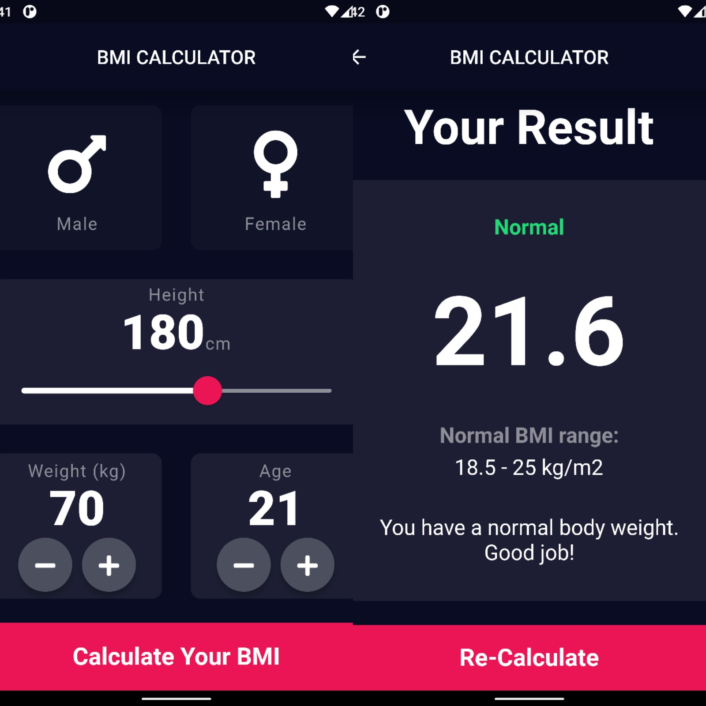

# BMI Calculator
This is a BMI (Body Mass Index) Calculator project built with Flutter. The app allows users to calculate their BMI based on their height and weight.

## Project (code) Structure
The project consists of the following files and directories:

- `lib/screens/input_page.dart`: This file contains the main screen of the BMI calculator, which allows the user to input their height, weight, and gender.
- `lib/screens/result_page.dart`: This file contains the screen that displays the calculated BMI result along with the interpretation.
- `lib/components/reusable_widget.dart`: This file contains reusable widget components used in the project, such as the custom card and round icon button.
- `lib/constants.dart`: This file contains constant values used throughout the project, such as colors, text styles, and UI dimensions.
- `lib/calculator_brain.dart`: This file contains the CalculatorBrain class, which calculates the BMI result and provides the interpretation based on the input values.
- `lib/main.dart`: This file contains the entry point of the application, including the main BMICalculator widget.

## Screenshots

## How to Use
1. Open the BMI Calculator app on your device or emulator.
2. Enter your height using the slider provided.
3. Use the weight and age buttons to adjust the respective values.
4. Select your gender by tapping on the male or female card.
5. Tap on the "Calculate Your BMI" button to see the calculated result.
6. The result page will display your BMI, its interpretation, and a range of normal BMI values.
7. Tap on the "Re-Calculate" button to go back to the input page and recalculate your BMI with different values.

## Features
1. **Calculate BMI**: Enter your height and weight, and the app will calculate your BMI.
2. **BMI Categories**: The app categorizes the calculated BMI into "Underweight," "Normal," and "Overweight".
3. **Interpretation**: The app provides an interpretation of the calculated BMI, giving advice based on the BMI category.

## Dependencies
This project uses the following dependencies:
- `flutter/material.dart`: The Flutter material library for UI components and theming.
- `flutter/services.dart`: Flutter services library for setting preferred device orientations.
- `font_awesome_flutter/font_awesome_flutter.dart`: The FontAwesome Flutter library for using custom icons.
- `dart:math`: The Dart math library for mathematical calculations.
Please make sure to have these dependencies installed and up to date before running the project.

## Author
This project was developed by Saher Muhamed @ 18/2/2023.
